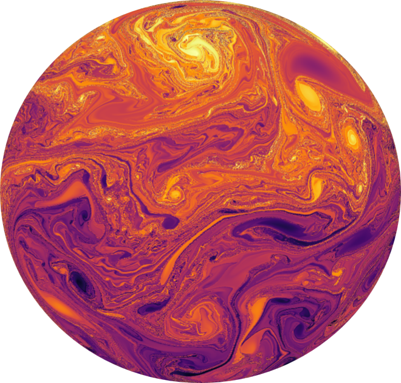

# The Spherical Characteristic Mapping Method

`CMM-S2` is a Python implementation of the Characteristic Mapping Method (CMM) on a spherical geometry. The CMM is a semi-Lagrangian scheme which computes the evolution of the inverse flow map through a spatiotemporal discretization formed by a composition of sub-interval flows. These are each represented as spline interpolants computing using the gradient-augmented level set method. This repository catalogues a collection of functions and tests relevant to this computation for linear advection and the incompressible Euler equations on the two-torus and on the sphere. It contains all relevant code needed to reproduce the figures and data in the paper *A characteristic mapping method for incompressible hydrodynamics on a rotating sphere*, Taylor, S., Nave, J.-C. [1](https://arxiv.org/pdf/2302.01205.pdf). The repository will be actively maintained and extended to solve other types of flows and in different domains.

# Functionality

The current implementation is capable of simulating turbulent fluid dynamics on a rotating sphere in the form of the barotropic vorticity equations and could be readily extended to other incompressible flow such as the quasi-geostrophic equations. It further provides a base solver class for the transport equation, which can be ported into other solvers for tracer and flow map analysis. The possess a number of unique resolution properties including the ability to upsample the solution with the correct statistics at subgrid scales and to coherently transport a multi-scale field. Here is an example simulation from the paper [1](https://arxiv.org/pdf/2302.01205.pdf)


# Structure and Dependencies

The `cmm-s2/core/` folder contains all core algorithms related to the time-stepping, interpolation, and the simulations. 

The `cmm-s2/tests/` folder contains unit tests for the components of the algorithm.

The `cmm-s2/experiments` folder contains numerical experiments seen in the paper 

Standard dependencies come from the `numpy` and `scipy` packages. Specific dependencies used in the implemenation include:

- The spherical harmonic transforms are performed using the `pyssht` [library](https://pypi.org/project/pyssht/)
- The spherical mesh generation is performed using the `stripy` [package](https://pypi.org/project/stripy/)

All dependencies can be installed via `pip`. <u> Note <u> the dependencies may change in the future. 

# Instructions to reproduce results

Please follow these steps to reproduce the results of the paper [1](https://arxiv.org/pdf/2302.01205.pdf):

- `git pull` this repo
- Create a directory called `data` in the same directory as the repo
- Replace the variable `path_to_data` variable in the test_barotropic_vorticity.py file with the absolute path to the data folder.
- From the repo directory run `python -m cmm-s2.tests.test_barotropic_vorticity test_name remapping` with `test_name` replaced by one of `zonal_jet`, `rossby_wave`, `rossby_wave_static`, or `gaussian_vortex` to produce the convergence test data. Replace remapping with `none` to run the same tests without the submap decomposition.
- The computed errors are obtained by running `python -m cmm-s2.figures.data_gen_euler test_name remapping` for each of the test cases.
- The experiments are run by `python -m cmm-s2.experiments.experiment_name` with `experiment_name` replaced by the name of the python script in the `cmm-s2/experiments/` directory. This will produce all the relevant map data and also perform the post-processing to produce the figures. 
- The `cmm-s2/figures/` directory also contains the matlab scripts used to generate the figures. 


# Cite

Should you use this code or any component of it, we kindly request that you cite the following works. 

The incompressible Euler solver is based on the paper [1](https://arxiv.org/pdf/2302.01205.pdf):

```
@article{taylor2023characteristic,
  title={A characteristic mapping method for incompressible hydrodynamics on a rotating sphere},
  author={Taylor, Seth and Nave, Jean-Christophe},
  journal={arXiv preprint arXiv:2302.01205},
  year={2023}
}
```

The linear advection solver is based on the paper [2](https://www.sciencedirect.com/science/article/pii/S0021999122009688):

```
@article{taylor2023projection,
  title={A projection-based Characteristic Mapping method for tracer transport on the sphere},
  author={Taylor, Seth and Nave, Jean-Christophe},
  journal={Journal of Computational Physics},
  volume={477},
  pages={111905},
  year={2023},
  publisher={Elsevier}
}

```

